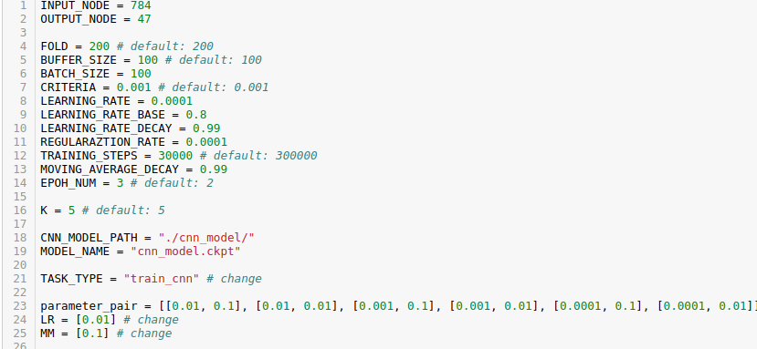
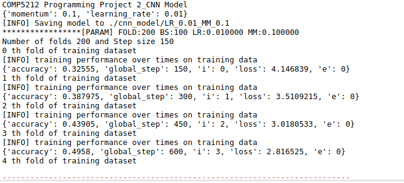
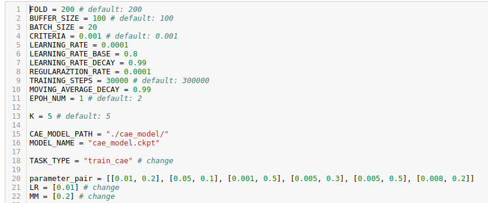
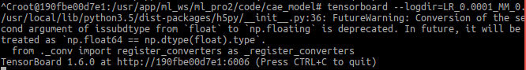

# Requirement
1. Anaconda
2. jupyter notebook
> http://jupyter.readthedocs.io/en/latest/install.html#install

# How to use
1. Code: **cnn_model_tflayer.ipynb** and **cae_model_tflayer.ipynb**
    ## cnn_model_tflayer.ipynb
    1. Paramter: the parameters used in the code are listed at the top
    
    2. Change training parameters: The LR(learning rate), MM(momentum factor) are two parameters need to be changed in paramter tuning. The variable **paramter_pair** lists the parameter selections, so you need to try each pari step by step. 
    3. Change mode: There are four modes for the code(1 for training and 3 for testing): "train_cnn"(implement a cross validation technique to training the cnn model), "test cnn"(once finish training, using test set to test to model), "eval_cnn"(using evaluation set) and "test_cnn_with_train"(using training set). Please change the variable **TASK_TYPE** for different mode. please note that in "train_cnn", if the model was saved previously, the training process will continue the past result.
    4. Run: Ctrl+Enter to the module, you can see the result below.
    

    ## cae_model_tflayer.ipynb
    1. Paramter: the parameters used in the code are listed at the top
    
    2. Change training parameters: The LR(learning rate), MM(momentum factor) are two parameters need to be changed in paramter tuning. The variable **paramter_pair** lists the parameter selections, so you need to try each pari step by step. 
    3. Change mode: There are four modes for the code(1 for training and 3 for testing): "train_cae"(implement a cross validation technique to training the cnn model), "test cae"(once finish training, using test set to test to model), "eval_cae"(using evaluation set) and "test_cnn_with_train"(using training set). Please change the variable **TASK_TYPE** for different mode. please note that in "train_cae", if the model was saved previously, the training process will continue the past result.
    4. Run: Ctrl+Enter to the module.

    ## Note
    1. If you want to visualize the result, I recommend you to use the **tensorboard** visulization tool. 
    > Usage: (ubuntu terminal) tensorboard --logdir=  
    > Example:  
    > 

# Contact
1. If you do not about jupyter, or meet some problems about running it, please feel free to contact me: jjiao@ust.hk
